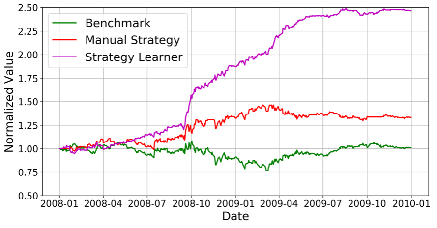

# Machine Learning for Stock Trading

## Output

## Code Description

* indicators.py: contains functions that calculate the technical indicators.

* marketsimcode.py: a market simulator that accepts trading orders and keep track of a portfolio’s value over time.

* RTLearner.py: a random tree learner object

* BagLearner.py: a bag learner that ensembles the random tree learners  

* ManualStrategy.py: implements the Manual Strategy object. It implements "testPolicy" which returns a trade data frame based on the selected stock symbol and date range.

* StrategyLearner.py: implements the Strategy Learner object. It accepts training data through "add_evidence" to train the learner, and implements "testPolicy" to return a trade data frame.

* experiment1.py: conducts experiment 1 as required by the project and generate the figures and statistics.

* experiment2.py: conducts experiment 2 as required by the project and generate the figures and statistics.

* testproject.py: runs all necessary codes that generate the figures and portfolio statistics in the report

## Running
`python testproject.py`

